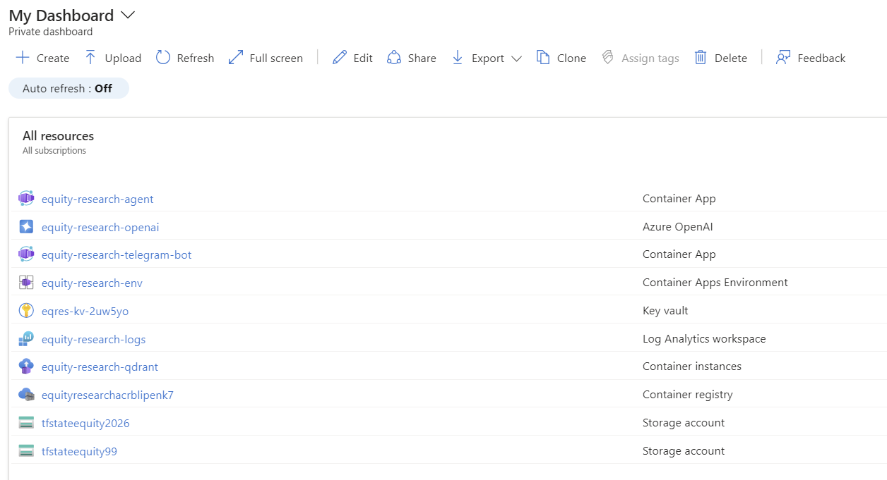

<p align="center">
  <h1 align="center">Equity Research Agent</h1>
  <p align="center">
    <strong>AI-powered autonomous quantitative analyst</strong>
  </p>
  <p align="center">
    <a href="https://github.com/nolancacheux/equity-research-agent/actions/workflows/ci.yml"></a>
    <a href="https://github.com/nolancacheux/equity-research-agent/actions/workflows/deploy.yml"></a>
    <a href="https://www.python.org/downloads/"></a>
    <a href="https://github.com/astral-sh/uv"></a>
    <a href="https://opensource.org/licenses/MIT"></a>
  </p>
</p>

---

<p align="center">
  <b>Author:</b> <a href="https://github.com/nolancacheux">Nolan Cacheux</a> · <a href="https://www.linkedin.com/in/nolancacheux/">LinkedIn</a>
</p>

---

## Overview

An autonomous AI agent that performs professional-grade equity research by aggregating and analyzing multiple data sources in real-time. Built with **LangGraph** for orchestration, **hybrid RAG** for document analysis, and deployed on **Azure Container Apps**.

<p align="center">
  
</p>

<p align="center">
  
</p>

### What It Does

```
User: "Analyze NVIDIA's position. Compare P/E with AMD, check 10-K for China risks."
```

The agent autonomously:
1. Fetches real-time market data (price, P/E, market cap)
2. Downloads and searches SEC 10-K filings using hybrid RAG
3. Analyzes earnings call transcripts
4. Aggregates social sentiment from Reddit
5. Compares metrics with industry peers
6. Generates a professional research report

---

## Architecture

<details>
<summary><b>🏗️ High-Level System Design</b> (click to expand)</summary>

```
┌─────────────────────────────────────────────────────────────────────────────┐
│                              USER INTERFACES                                 │
├─────────────────────────────────────────────────────────────────────────────┤
│                                                                              │
│     ┌──────────────┐              ┌──────────────┐                          │
│     │   Telegram   │              │   REST API   │                          │
│     │     Bot      │              │   (FastAPI)  │                          │
│     └──────┬───────┘              └──────┬───────┘                          │
│            │                             │                                   │
│            └─────────────┬───────────────┘                                   │
│                          ▼                                                   │
│            ┌─────────────────────────┐                                       │
│            │    LangGraph Engine     │                                       │
│            │   (Research Pipeline)   │                                       │
│            └─────────────┬───────────┘                                       │
│                          │                                                   │
└──────────────────────────┼───────────────────────────────────────────────────┘
                           │
┌──────────────────────────┼───────────────────────────────────────────────────┐
│                          ▼            AGENT LAYER                            │
├─────────────────────────────────────────────────────────────────────────────┤
│                                                                              │
│  ┌─────────────┐  ┌─────────────┐  ┌─────────────┐  ┌─────────────┐        │
│  │   Market    │  │  Document   │  │    News     │  │  Earnings   │        │
│  │    Data     │  │   Reader    │  │  Sentiment  │  │    Call     │        │
│  │   Agent     │  │   Agent     │  │   Agent     │  │   Agent     │        │
│  └──────┬──────┘  └──────┬──────┘  └──────┬──────┘  └──────┬──────┘        │
│         │                │                │                │                │
│  ┌──────┴──────┐  ┌──────┴──────┐  ┌──────┴──────┐  ┌──────┴──────┐        │
│  │   Reddit    │  │    Peer     │  │    Risk     │  │ Synthesizer │        │
│  │  Sentiment  │  │ Comparison  │  │   Scoring   │  │   Agent     │        │
│  │   Agent     │  │   Agent     │  │   Agent     │  │             │        │
│  └─────────────┘  └─────────────┘  └─────────────┘  └─────────────┘        │
│                                                                              │
└─────────────────────────────────────────────────────────────────────────────┘
                           │
┌──────────────────────────┼───────────────────────────────────────────────────┐
│                          ▼            DATA LAYER                             │
├─────────────────────────────────────────────────────────────────────────────┤
│                                                                              │
│  ┌─────────────┐  ┌─────────────┐  ┌─────────────┐  ┌─────────────┐        │
│  │   Yahoo     │  │     SEC     │  │   Reddit    │  │ DuckDuckGo  │        │
│  │  Finance    │  │   EDGAR     │  │     API     │  │   Search    │        │
│  └─────────────┘  └─────────────┘  └─────────────┘  └─────────────┘        │
│                                                                              │
│  ┌─────────────────────────────────────────────────────────────────┐        │
│  │                    RAG Pipeline (Hybrid Search)                  │        │
│  │  ┌─────────┐    ┌─────────┐    ┌─────────┐    ┌─────────┐      │        │
│  │  │ Chunker │ -> │  BM25   │ -> │  Dense  │ -> │Reranker │      │        │
│  │  │         │    │ Sparse  │    │Embedding│    │  (RRF)  │      │        │
│  │  └─────────┘    └─────────┘    └─────────┘    └─────────┘      │        │
│  └─────────────────────────────────────────────────────────────────┘        │
│                                                                              │
│  ┌─────────────┐  ┌─────────────┐  ┌─────────────┐                         │
│  │   Qdrant    │  │  In-Memory  │  │    Groq     │                         │
│  │ Vector DB   │  │   Cache     │  │  LLM API    │                         │
│  └─────────────┘  └─────────────┘  └─────────────┘                         │
│                                                                              │
└─────────────────────────────────────────────────────────────────────────────┘
```

</details>

<details>
<summary><b>🔄 LangGraph Research Pipeline</b> (click to expand)</summary>

```
                              ┌─────────────┐
                              │    START    │
                              └──────┬──────┘
                                     │
                                     ▼
                         ┌───────────────────────┐
                         │    Parse Query        │
                         │  (Extract tickers,    │
                         │   identify intent)    │
                         └───────────┬───────────┘
                                     │
                                     ▼
                         ┌───────────────────────┐
                         │   Market Data Agent   │
                         │  (Fetch quotes,       │
                         │   financials)         │
                         └───────────┬───────────┘
                                     │
                        ┌────────────┴────────────┐
                        ▼                         ▼
            ┌─────────────────────┐   ┌─────────────────────┐
            │  Document Analysis? │   │   Skip Documents    │
            │        YES          │   │        NO           │
            └──────────┬──────────┘   └──────────┬──────────┘
                       │                         │
                       ▼                         │
            ┌─────────────────────┐              │
            │  Document Reader    │              │
            │  (SEC 10-K RAG)     │              │
            └──────────┬──────────┘              │
                       │                         │
                       └────────────┬────────────┘
                                    │
                                    ▼
                    ┌───────────────────────────────┐
                    │      Parallel Analysis        │
                    ├───────────────────────────────┤
                    │  ┌─────────┐  ┌─────────┐    │
                    │  │  News   │  │ Reddit  │    │
                    │  │Sentiment│  │Sentiment│    │
                    │  └─────────┘  └─────────┘    │
                    │  ┌─────────┐  ┌─────────┐    │
                    │  │Earnings │  │  Peer   │    │
                    │  │  Calls  │  │Compare  │    │
                    │  └─────────┘  └─────────┘    │
                    └───────────────┬───────────────┘
                                    │
                                    ▼
                         ┌───────────────────────┐
                         │   Synthesizer Agent   │
                         │  (Generate report,    │
                         │   executive summary)  │
                         └───────────┬───────────┘
                                     │
                                     ▼
                              ┌─────────────┐
                              │     END     │
                              └─────────────┘
```

</details>

<details>
<summary><b>☁️ Azure Deployment Architecture</b> (click to expand)</summary>

```
┌─────────────────────────────────────────────────────────────────────────────┐
│                              AZURE CLOUD                                     │
├─────────────────────────────────────────────────────────────────────────────┤
│                                                                              │
│    ┌────────────────────────────────────────────────────────────────┐       │
│    │              Container Apps Environment                         │       │
│    │                  (equity-research-env)                          │       │
│    │  ┌──────────────────────────────────────────────────────────┐  │       │
│    │  │                                                          │  │       │
│    │  │  ┌─────────────┐  ┌─────────────┐  ┌─────────────┐     │  │       │
│    │  │  │  API App    │  │  Bot App    │  │   Qdrant    │     │  │       │
│    │  │  │  (FastAPI)  │  │ (Telegram)  │  │ (Vector DB) │     │  │       │
│    │  │  │  Port 8000  │  │  Polling    │  │  Port 6333  │     │  │       │
│    │  │  └──────┬──────┘  └──────┬──────┘  └─────────────┘     │  │       │
│    │  │         │                │                              │  │       │
│    │  │         │    Internal    │                              │  │       │
│    │  │         │◄──  Network  ──┤                              │  │       │
│    │  │         │                │                              │  │       │
│    │  └─────────┼────────────────┼──────────────────────────────┘  │       │
│    │            │                │                                  │       │
│    └────────────┼────────────────┼──────────────────────────────────┘       │
│                 │                │                                           │
│    ┌────────────┼────────────────┼──────────────────────────────────┐       │
│    │            │                │                                   │       │
│    │  ┌─────────▼─────────┐  ┌──▼───────────────┐                  │       │
│    │  │ Container Registry│  │   Key Vault      │                  │       │
│    │  │ (equityresearchacr│  │ (Secrets)        │                  │       │
│    │  └───────────────────┘  └──────────────────┘                  │       │
│    │                                                                │       │
│    │  ┌───────────────────┐  ┌──────────────────┐                  │       │
│    │  │  Log Analytics    │  │  Storage Account │                  │       │
│    │  │  (Monitoring)     │  │  (Terraform)     │                  │       │
│    │  └───────────────────┘  └──────────────────┘                  │       │
│    │                                                                │       │
│    └────────────────────────────────────────────────────────────────┘       │
│                                                                              │
└─────────────────────────────────────────────────────────────────────────────┘

                                    │
         ┌──────────────────────────┼──────────────────────────┐
         │                          │                          │
         ▼                          ▼                          ▼
┌─────────────────┐      ┌─────────────────┐      ┌─────────────────┐
│  Telegram API   │      │    Groq API     │      │  External Data  │
│                 │      │   (LLM/Free)    │      │  (Yahoo, SEC)   │
└─────────────────┘      └─────────────────┘      └─────────────────┘
```

</details>

<details>
<summary><b>🚀 CI/CD Pipeline</b> (click to expand)</summary>

```
┌──────────────┐     ┌──────────────┐     ┌──────────────┐     ┌──────────────┐
│     Push     │────>│     Lint     │────>│    Tests     │────>│   Security   │
│   to main    │     │    (Ruff)    │     │   (pytest)   │     │   (Bandit)   │
└──────────────┘     └──────────────┘     └──────────────┘     └──────┬───────┘
                                                                       │
                                                                       ▼
┌──────────────┐     ┌──────────────┐     ┌──────────────┐     ┌──────────────┐
│   Deploy     │<────│  Push to     │<────│    Build     │<────│  Terraform   │
│  to Azure    │     │    ACR       │     │   Images     │     │   Validate   │
└──────────────┘     └──────────────┘     └──────────────┘     └──────────────┘
```

</details>

---

## Features

| Category | Feature | Description |
|----------|---------|-------------|
| **Analysis** | Multi-source Research | Aggregates Yahoo Finance, SEC filings, news, social sentiment |
| **Analysis** | Hybrid RAG | BM25 sparse + dense embeddings with RRF fusion |
| **Analysis** | DCF Valuation | Discounted cash flow fair value calculation |
| **Analysis** | Risk Scoring | 10-K risk factor analysis (1-10 scale) |
| **Data** | Real-time Quotes | Live prices, P/E, market cap, volume |
| **Data** | SEC 10-K/10-Q | Automatic download and indexing |
| **Data** | Earnings Calls | Transcript analysis and summarization |
| **Social** | Reddit Sentiment | WSB, r/stocks, r/investing aggregation |
| **Tools** | Peer Comparison | Side-by-side competitor metrics |
| **Tools** | Watchlist | Personal stock tracking with alerts |
| **Tools** | Price Alerts | Notifications on price/P/E thresholds |

---

## Quick Start

### Prerequisites

- Python 3.11+
- [uv](https://github.com/astral-sh/uv) package manager
- Docker & Docker Compose

### Installation

```bash
# Clone repository
git clone https://github.com/nolancacheux/equity-research-agent.git
cd equity-research-agent

# Install dependencies with uv
uv venv && source .venv/bin/activate
uv pip install -e ".[dev]"

# Configure environment
cp .env.example .env
# Edit .env: Add GROQ_API_KEY (free at console.groq.com)
```

### Run Locally

```bash
# Start infrastructure
docker-compose up -d qdrant

# Start API server
uvicorn src.api.main:app --reload --port 8000

# Start Telegram bot (separate terminal)
python -m src.telegram.bot
```

### Development

```bash
# Run tests with coverage
uv run pytest --cov=src --cov-report=html

# Lint and format
uv run ruff check --fix src/
uv run ruff format src/

# Type checking
uv run mypy src/
```

---

## API Reference

<details>
<summary><b>📡 Core Endpoints</b></summary>

| Method | Endpoint | Description |
|--------|----------|-------------|
| `GET` | `/health` | Health check |
| `GET` | `/quote/{ticker}` | Real-time stock quote |
| `GET` | `/compare/{tickers}` | Compare multiple stocks |
| `POST` | `/analyze` | Full research analysis |

</details>

<details>
<summary><b>🔧 Analysis Tools</b></summary>

| Method | Endpoint | Description |
|--------|----------|-------------|
| `GET` | `/dcf/{ticker}` | DCF fair value calculation |
| `GET` | `/risk/{ticker}` | 10-K risk score (1-10) |
| `GET` | `/peers/{ticker}` | Peer comparison |
| `GET` | `/reddit/{ticker}` | Reddit sentiment |
| `GET` | `/earnings/{ticker}` | Earnings call summary |

</details>

<details>
<summary><b>📋 Watchlist</b></summary>

| Method | Endpoint | Description |
|--------|----------|-------------|
| `GET` | `/watchlist/{user_id}` | Get user's watchlist |
| `POST` | `/watchlist/{user_id}/add` | Add stock to watchlist |
| `POST` | `/watchlist/{user_id}/alert` | Create price alert |

</details>

---

## Telegram Bot Commands

| Command | Description |
|---------|-------------|
| `/start` | Welcome message and menu |
| `/q NVDA` | Quick stock quote |
| `/analyze <query>` | Full research analysis |
| `/compare NVDA,AMD` | Compare stocks |
| `/dcf NVDA` | DCF valuation |
| `/risk NVDA` | Risk score |
| `/peers NVDA` | Peer comparison |
| `/watchlist` | View/manage watchlist |
| `/alert NVDA above 150` | Set price alert |

---

## Configuration

<details>
<summary><b>⚙️ Environment Variables</b></summary>

| Variable | Required | Description |
|----------|----------|-------------|
| `GROQ_API_KEY` | Yes | Groq API key (free tier) |
| `TELEGRAM_BOT_TOKEN` | Yes | Telegram bot token |
| `QDRANT_URL` | No | Qdrant URL (default: localhost:6333) |
| `AZURE_OPENAI_*` | No | Azure OpenAI credentials (optional) |
| `LANGCHAIN_API_KEY` | No | LangSmith tracing (optional) |

</details>

---

## Azure Deployment

<details>
<summary><b>🔐 GitHub Secrets Required</b></summary>

```
AZURE_CREDENTIALS          # Service principal JSON
AZURE_CLIENT_ID           # SP client ID
AZURE_CLIENT_SECRET       # SP secret
AZURE_SUBSCRIPTION_ID     # Subscription ID
AZURE_TENANT_ID           # Tenant ID
ACR_LOGIN_SERVER          # equityresearchacr.azurecr.io
ACR_USERNAME              # ACR admin username
ACR_PASSWORD              # ACR admin password
TELEGRAM_BOT_TOKEN        # Bot token
GROQ_API_KEY              # Groq API key
```

</details>

<details>
<summary><b>🌍 Deploy with Terraform</b></summary>

```bash
cd terraform
terraform init
terraform plan
terraform apply
```

</details>

<details>
<summary><b>💰 Estimated Costs</b></summary>

| Resource | Monthly Cost |
|----------|-------------|
| Container Apps (Consumption) | $0-10 |
| Container Registry (Basic) | $5 |
| Log Analytics | $0-5 |
| **Total** | **~$5-20** |

</details>

---

## Tech Stack

| Layer | Technologies |
|-------|-------------|
| **LLM** | Groq (Llama 3.3 70B), Azure OpenAI |
| **Orchestration** | LangGraph, LangChain |
| **RAG** | Qdrant, BM25, Hybrid Search, Reranking |
| **Data Sources** | Yahoo Finance, SEC EDGAR, Reddit, DuckDuckGo |
| **Backend** | FastAPI, Pydantic |
| **Bot** | python-telegram-bot |
| **Infrastructure** | Docker, Azure Container Apps, Terraform |
| **CI/CD** | GitHub Actions |
| **Quality** | uv, Ruff, pytest, Bandit |

---

## Project Structure

<details>
<summary><b>📁 Directory Layout</b></summary>

```
equity-research-agent/
├── src/
│   ├── agents/           # LangGraph agents
│   │   ├── graph.py      # Main orchestration
│   │   ├── market_data.py
│   │   ├── document_reader.py
│   │   ├── news_sentiment.py
│   │   ├── reddit_agent.py
│   │   ├── earnings_agent.py
│   │   ├── peer_agent.py
│   │   ├── risk_agent.py
│   │   └── synthesizer.py
│   ├── services/         # Business logic
│   │   ├── dcf_valuation.py
│   │   ├── risk_scoring.py
│   │   └── watchlist.py
│   ├── tools/            # Data fetchers
│   │   ├── yfinance_tool.py
│   │   ├── sec_edgar_tool.py
│   │   ├── search_tool.py
│   │   └── reddit_sentiment_tool.py
│   ├── rag/              # RAG pipeline
│   │   ├── chunking.py
│   │   ├── hybrid_search.py
│   │   ├── vector_store.py
│   │   └── reranker.py
│   ├── api/              # FastAPI app
│   │   └── main.py
│   └── telegram/         # Telegram bot
│       ├── bot.py
│       ├── handlers.py
│       └── keyboards.py
├── terraform/            # Infrastructure as Code
├── tests/                # Test suite (205 tests)
├── pyproject.toml        # Project config
├── Dockerfile.api        # API container
├── Dockerfile.bot        # Bot container
└── docker-compose.yml    # Local development
```

</details>

---

## Security

- **No hardcoded secrets** - All credentials via environment variables
- **Rate limiting** - API endpoints protected with SlowAPI
- **Input validation** - Pydantic models for all inputs
- **Security scanning** - Bandit in CI pipeline
- **Dependency auditing** - Regular updates via Dependabot

---

## License

MIT License - see [LICENSE](LICENSE)

---

## Contributing

1. Fork the repository
2. Create a feature branch (`git checkout -b feat/amazing-feature`)
3. Commit changes (`git commit -m 'feat: add amazing feature'`)
4. Push to branch (`git push origin feat/amazing-feature`)
5. Open a Pull Request

---

<p align="center">
  Made with ❤️ by <a href="https://github.com/nolancacheux">Nolan Cacheux</a>
</p>
